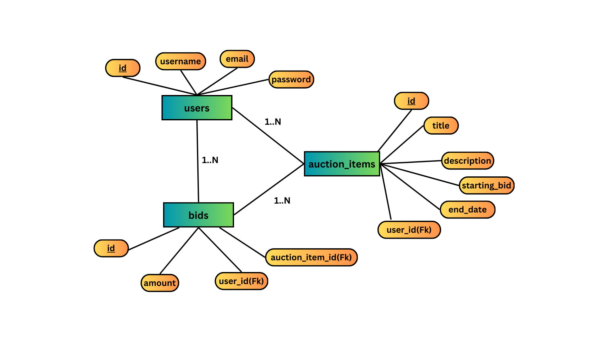

## Database Schema

### ER Diagram

### Tables

## Users Table
**Table Name:** users

This table stores the details of each user registered in the system.

| Column Name | Data Type       | Constraints                          | Description                              |
|-------------|------------------|-------------------------------------|------------------------------------------|
| id          | Integer          | Primary Key, Auto-Increment         | Unique identifier for each user         |
| username    | String(50)       | Not Null, Unique                    | Username of the user                    |
| email       | String(120)      | Not Null, Unique                    | Email address of the user               |
| password    | String(128)      | Not Null                            | Hashed password of the user             |

---

## Auction Items Table
**Table Name:** auction_items

This table stores the details of each auction item listed by users.

| Column Name      | Data Type       | Constraints                          | Description                                    |
|------------------|------------------|-------------------------------------|------------------------------------------------|
| id               | Integer          | Primary Key, Auto-Increment         | Unique identifier for each auction item       |
| title            | String(100)      | Not Null                            | Title of the auction item                     |
| description      | Text             | Not Null                            | Description of the auction item               |
| starting_bid     | Float            | Not Null                            | Starting bid amount for the auction item      |
| end_date         | DateTime         | Not Null                            | End date and time for the auction item       |
| user_id          | Integer          | Foreign Key (users.id), Not Null   | Identifier of the user who listed the item    |

---

## Bids Table
**Table Name:** bids

This table stores the details of each bid placed on auction items.

| Column Name        | Data Type       | Constraints                          | Description                                      |
|--------------------|------------------|-------------------------------------|--------------------------------------------------|
| id                 | Integer          | Primary Key, Auto-Increment         | Unique identifier for each bid                   |
| amount             | Float            | Not Null                            | Amount of the bid                                |
| user_id            | Integer          | Foreign Key (users.id), Not Null   | Identifier of the user who placed the bid        |
| auction_item_id    | Integer          | Foreign Key (auction_items.id), Not Null | Identifier of the auction item being bid on     |

### Relationships

- A user can create multiple auction items.
- A user can place multiple bids.
- An auction item can have multiple bids.

## Design Decisions

1. **Separation of Concerns**: The project is divided into frontend and backend directories to separate client-side and server-side logic.
2. **Authentication**: Used Flask-Login and Flask-Bcrypt for handling user authentication and password hashing.
3. **API Documentation**: Used Markdown for API documentation to make it easy for developers to understand and use the API.
4. **Responsive Design**: Ensured the frontend is responsive to provide a good user experience across different devices.
5. **Security**: Implemented user authentication and authorization to secure the endpoints.