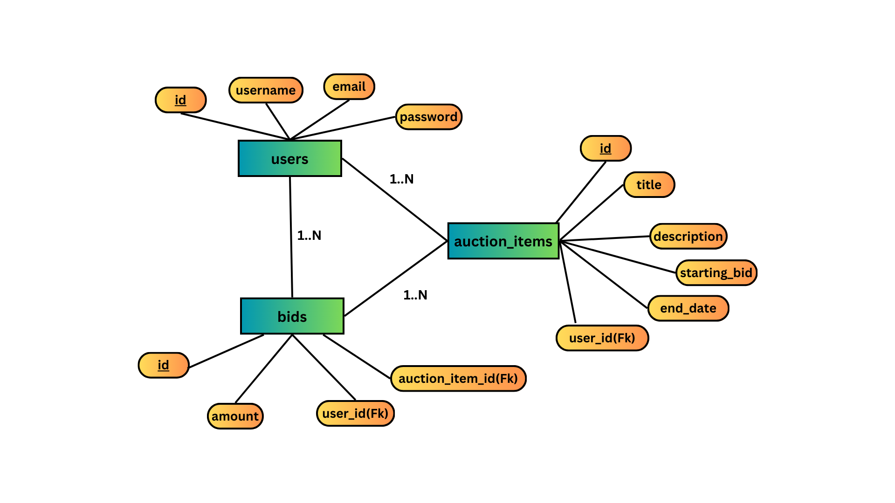

# Auction App

An auction platform where users can register, create auction items, place bids, and view their activities. This project is built using Flask for the backend and React for the frontend.

## Table of Contents

- [Features](#features)
- [Tech Stack](#tech-stack)
- [Setup Instructions](#setup-instructions)
  - [Backend Setup](#backend-setup)
  - [Frontend Setup](#frontend-setup)
  - [Running the Application](#running-the-application)
- [API Documentation](#api-documentation)
- [Database Schema](#database-schema)
- [Design Decisions](#design-decisions)

## Features

- User registration and authentication
- Create, update, delete, and view auction items
- Place bids on auction items
- View current highest bids and bid history
- User profile with auction and bid history
- Responsive design

## Tech Stack

- **Backend**: Flask, SQLAlchemy, Flask-Login, Flask-Bcrypt, MySQL, Flask-CORS
- **Frontend**: React, Axios, React Router
- **Database**: MySQL

## Setup Instructions

### Backend Setup

1. **Clone the Repository**:

    ```sh
    git clone <repository_url>
    cd myapp/backend
    ```

2. **Create a Virtual Environment**:

    ```sh
    python3 -m venv venv
    source venv/bin/activate
    ```

3. **Install Dependencies**:

    ```sh
    pip install -r requirements.txt
    ```

4. **Set Up the Database**:

    - Ensure you have MySQL installed and running.
    - Create a new MySQL database:
  
      ```sh
      mysql -u root -p
      CREATE DATABASE auction_db;
      ```
    - Also create the necessary tables:
    ```sh
      use auction_db;
      CREATE TABLE users ( id INT AUTO_INCREMENT PRIMARY KEY, username VARCHAR(150) NOT NULLUNIQUE, email VARCHAR(150) NOT NULL UNIQUE, password VARCHAR(150) NOT NULL );
      CREATE TABLE auction_items ( id INT AUTO_INCREMENT PRIMARY KEY, title VARCHAR(100) NOT NULL, description TEXT NOT NULL, starting_bid DECIMAL(10, 2) NOT NULL, end_date DATETIME NOT NULL, user_id INT, FOREIGN KEY (user_id) REFERENCES users(id) );
      CREATE TABLE bids ( id INT AUTO_INCREMENT PRIMARY KEY, amount DECIMAL(10, 2) NOT NULL, user_id INT, auction_item_id INT, FOREIGN KEY (user_id) REFERENCES users(id), FOREIGN KEY (auction_item_id) REFERENCES auction_items(id) );

      ```

5. **Configure the Database URI**:

    Update the `app.config['SQLALCHEMY_DATABASE_URI']` in `backend/app/__init__.py` with your MySQL credentials.


6. **Run the Backend Server**:

    ```sh
    python3 run.py
    ```

### Frontend Setup

1. **Navigate to the Frontend Directory**:

    ```sh
    cd ../frontend
    ```

2. **Install Dependencies**:

    ```sh
    npm install
    ```

3. **Run the Frontend Server**:

    ```sh
    npm start
    ```
    

### Running the Application

- **Backend**: http://localhost:8000
- **Frontend**: http://localhost:3000

## API Documentation

API documentation is provided via Markdown in API_markdown.md file


## Database Schema

### ER Diagram


### Tables

## Users Table
**Table Name:** users

This table stores the details of each user registered in the system.

| Column Name | Data Type       | Constraints                          | Description                              |
|-------------|------------------|-------------------------------------|------------------------------------------|
| id          | Integer          | Primary Key, Auto-Increment         | Unique identifier for each user         |
| username    | String(50)       | Not Null, Unique                    | Username of the user                    |
| email       | String(120)      | Not Null, Unique                    | Email address of the user               |
| password    | String(128)      | Not Null                            | Hashed password of the user             |

---

## Auction Items Table
**Table Name:** auction_items

This table stores the details of each auction item listed by users.

| Column Name      | Data Type       | Constraints                          | Description                                    |
|------------------|------------------|-------------------------------------|------------------------------------------------|
| id               | Integer          | Primary Key, Auto-Increment         | Unique identifier for each auction item       |
| title            | String(100)      | Not Null                            | Title of the auction item                     |
| description      | Text             | Not Null                            | Description of the auction item               |
| starting_bid     | Float            | Not Null                            | Starting bid amount for the auction item      |
| end_date         | DateTime         | Not Null                            | End date and time for the auction item       |
| user_id          | Integer          | Foreign Key (users.id), Not Null   | Identifier of the user who listed the item    |

---

## Bids Table
**Table Name:** bids

This table stores the details of each bid placed on auction items.

| Column Name        | Data Type       | Constraints                          | Description                                      |
|--------------------|------------------|-------------------------------------|--------------------------------------------------|
| id                 | Integer          | Primary Key, Auto-Increment         | Unique identifier for each bid                   |
| amount             | Float            | Not Null                            | Amount of the bid                                |
| user_id            | Integer          | Foreign Key (users.id), Not Null   | Identifier of the user who placed the bid        |
| auction_item_id    | Integer          | Foreign Key (auction_items.id), Not Null | Identifier of the auction item being bid on     |


### Relationships

- A user can create multiple auction items.
- A user can place multiple bids.
- An auction item can have multiple bids.

## Design Decisions

1. **Separation of Concerns**: The project is divided into frontend and backend directories to separate client-side and server-side logic.
2. **Authentication**: Used Flask-Login and Flask-Bcrypt for handling user authentication and password hashing.
3. **API Documentation**: Used Markdown for API documentation to make it easy for developers to understand and use the API.
4. **Responsive Design**: Ensured the frontend is responsive to provide a good user experience across different devices.
5. **Security**: Implemented user authentication and authorization to secure the endpoints.

## Additional Notes

- Ensure both frontend and backend servers are running simultaneously.
- For development, both servers should be run in development mode to enable hot-reloading and easier debugging.

Feel free to contribute to the project or raise issues if you find any bugs!


